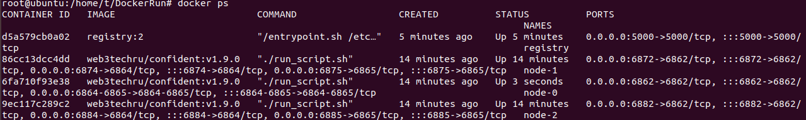
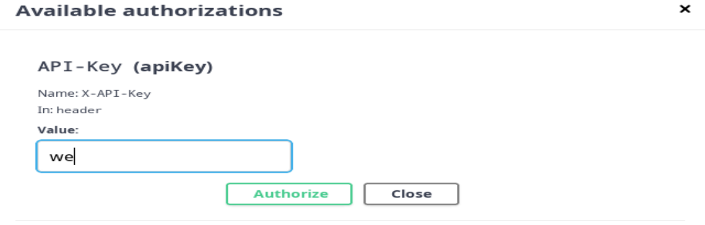
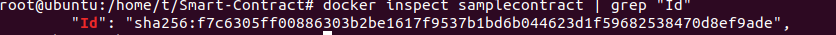
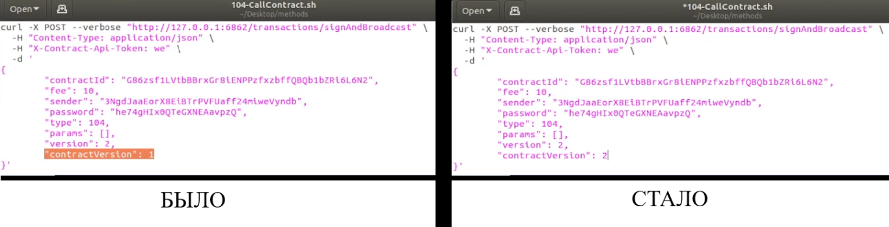
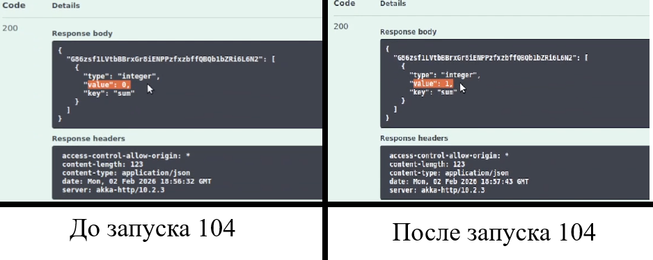
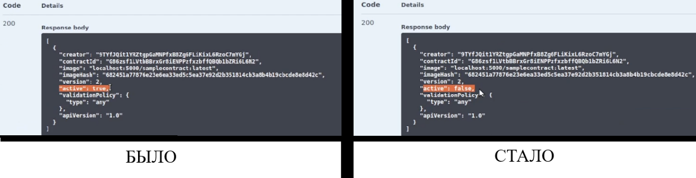

# Rasb: Система мониторинга и валидации датчиков

Система реального времени для сбора, мониторинга и валидации данных (температура, освещенность, давление). Предназначена для установки на мобильные ноды (Raspberry Pi). Работает в связке со смарт-контрактами для верификации диапазонов допустимых значений.

## 🏗 Архитектура системы

Проект разделен на логические блоки:

*   **Smart-Contract**: Содержит proto-файлы, код контракта и зависимости для развертывания.
*   **Methods**: Вызовы, описывающие логику взаимодействия блокчейна и контракта.
*   **Rasb (Raspberry Pi)**: Основная директория с логикой мониторинга.

### Компоненты директории Rasb:
1.  `Rasb_srv.py` — основной сервер. Принимает JSON-контракт, обрабатывает данные и валидирует показания микроконтроллера.
2.  `script_download.sh` — загрузчик. Скачивает контракт с платформы Confident и инициализирует сервер.
3.  `test_script_srv.sh` — эмулятор. Имитирует отправку данных с датчиков для тестирования.

## 🚀 Запуск (для мобильной ноды)

> **Важно:** Перед запуском убедитесь, что контракт уже размещен в нодах.

1.  **Инициализация сервера:**
    ```bash
    ./script_download.sh
    ```
2.  **Эмуляция данных (в новом терминале):**
    ```bash
    ./test_script_srv.sh
    ```
3.  **Остановка системы:**
    Для завершения работы создайте стоп-файл:
    ```bash
    touch FLAG_FILE.txt
    ```
    *После обнаружения файла сервер вычислит средние значения, проверит их на соответствие диапазонам и завершит работу.*

## 📊 Форматы данных

### Входные данные от контракта (JSON через stdin):
```json
{
  "contract_id": [
    { "key": "temperature", "value": "20/35", "type": "string" },
    { "key": "light", "value": "700/1100", "type": "string" },
    { "key": "press", "value": "900/1100", "type": "string" }
  ]
}


## Инструкция и результаты работы

### Запуск и проверка сети
Перед началом работы убедитесь, что все контейнеры запущены (Up):


### Авторизация
Для доступа к API используйте стандартный ключ `we`:


### Работа с контрактом
1. Получите хэш собранного образа:


2. При вызове обновленного контракта меняйте `contractVersion` в скриптах:


### Результаты
Изменение данных в блокчейне (поле sum стало 1):


Отключение смарт-контракта (статус active: false):



